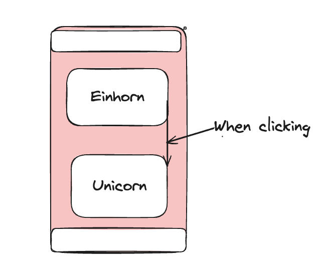

## User Story -1 Flashcard Demo

## Value Preposition

As an student
I want to see pairs of information in English and German
So that I can test the app an see how it works

## Description

## Acceptance criteria

- [ ] An example card is shown
- [ ] Translation appears on click
- [ ] The cards are shown as a vertical list
- [ ] Header is always visible

## Tasks

- [ ] Create a data-array in lib/data with 10 example word-pairs
- [ ] Data-array contains: id, englisch-word, german-word
- [ ] Create component Card to render the Flashcard
- [ ] Create default function HomePage  in “pages/ index.js“ that renders our Card component
- [ ] Create Header component
- [ ] Render Header component in pages/ index.js
      
