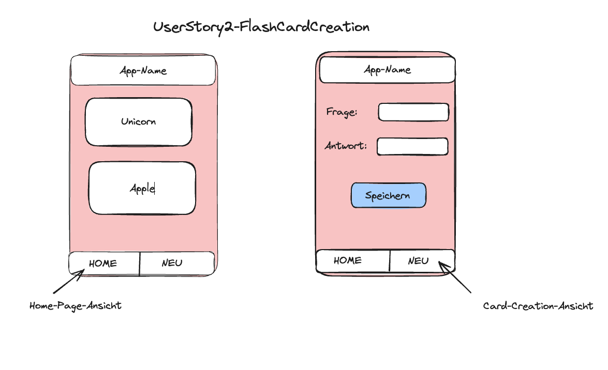

## User Story -2 Flashcard Creation

## Value Preposition

As an student
I want to add my own Flashcards with my own pairs of words
So that I can learn my own subjects

## Description

## Acceptance criteria

- [ ] you see the Footer with the Homepage-Button and the "new Cards"-Button
- [ ] you click on a button to create new cards
- [ ] you can write your own pair of words an submit them

## Tasks

- [ ] Create
- [ ]
- [ ]
